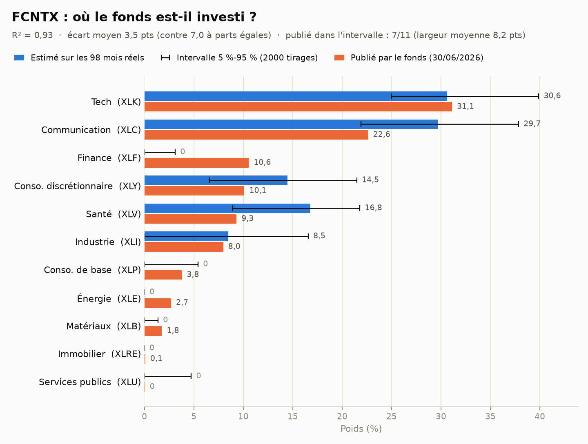

# Peut-on deviner où un fonds est investi en regardant seulement sa performance ?


> [!NOTE]
> **Conclusion** : la méthode retrouve les grandes masses (technologie, communication,
> consommation discrétionnaire, industrie), mais avec des intervalles larges, de 13 points en moyenne
> pour les gros secteurs. Elle sous-estime systématiquement la finance et les petits secteurs,
> qu'elle met à zéro : c'est un biais de la méthode, pas un hasard de l'échantillon.

<p align="center">
  <picture>
    <source media="(prefers-color-scheme: dark)" srcset="figures/estime_vs_publie_sombre.png">
    
  </picture>
</p>

<div align="center">

| Ressemblance (R²) | Écart moyen | Repère à parts égales | Publié dans l'intervalle | Largeur moyenne des intervalles |
|:---:|:---:|:---:|:---:|:---:|
| **0,93** | **3,5 pts** | 7,0 pts | **7 sur 11** (≈ 10 attendus) | 8,2 pts |

</div>

## L'idée

Un fonds d'investissement publie sa performance chaque mois, mais pas toujours le détail
de ce qu'il détient, et jamais en temps réel. J'ai voulu voir si on peut retrouver
la répartition par secteur d'un fonds **à partir de sa seule performance**, puis vérifier
le résultat contre ce que le fonds publie.

Le fonds étudié est **Fidelity Contrafund (FCNTX)**, un fonds américain d'actions
géré activement.

## La méthode, en 4 étapes

1. **Données** : les rendements mensuels du fonds et de 11 ETF sectoriels
   (technologie, santé, finance, énergie, etc.).
2. **Reconstruction** : la combinaison de ces 11 ETF qui ressemble le plus au fonds,
   avec des poids positifs dont la somme fait 100 % :

   $$r_{\text{fonds}} \approx \alpha + \sum_{i=1}^{11} w_i \, r_{\text{ETF}_i} \qquad w_i \ge 0,\ \sum_i w_i = 1$$

3. **Intervalles** : l'estimation est refaite 2000 fois sur des historiques rééchantillonnés
   (bootstrap par blocs de 3 mois, voir ci-dessous). On obtient un intervalle par secteur
   autour de l'estimation principale.
4. **Vérification** : ces poids sont comparés aux pondérations sectorielles publiées par le fonds.

Un ETF sectoriel sert ici de « règle graduée » : si le fonds évolue comme l'ETF
technologie, alors il a probablement beaucoup de technologie. Le fonds ne détient pas
ces ETF.

### Le bootstrap, en bref

On ne dispose que d'un seul historique de 98 mois. Le bootstrap consiste à fabriquer de nombreux
historiques « possibles » en retirant au hasard, avec remise, des morceaux de l'historique réel,
puis à refaire l'estimation sur chacun. Si les poids changent beaucoup d'un tirage à l'autre,
l'estimation est fragile ; s'ils bougent peu, elle est fiable.

Les morceaux tirés sont des **blocs de 3 mois consécutifs** : les rendements d'un mois ne sont pas
indépendants de ceux des mois voisins (tendances, crises qui durent), et tirer des mois isolés
casserait ces enchaînements.

- **Intervalle** : de 5 % à 95 % des 2000 poids obtenus, soit 90 % des tirages.
- **Valeur principale** : l'estimation sur les 98 mois réels, qui fait 100 %. Elle tombe dans
  son propre intervalle pour les 11 secteurs.

> [!WARNING]
> **Choix fait après un premier essai.** La première version utilisait comme valeur principale la
> moyenne des tirages. Ce choix a été fait après avoir vu un résultat, puis écarté : les poids ne
> pouvant pas descendre sous 0, la moyenne des tirages remonte artificiellement les petits secteurs
> (un secteur estimé à 0 obtient une moyenne positive, jusqu'à 0,8 %). Le nombre de tirages est
> passé de 200 à 2000 après ce premier essai : l'estimation principale n'en dépend pas, et les bornes
> des intervalles bougent d'au plus 1,3 point.

## Que contient chaque ETF ?

Chaque ETF réplique un secteur du S&P 500. Il est souvent dominé par quelques très grandes
entreprises : son comportement reflète donc surtout le leur.

| Secteur | ETF | Principales entreprises (poids dans l'ETF) |
|---|---|---|
| Technologie | XLK | NVIDIA (14,4 %), Apple (12,5 %), Microsoft (10,1 %), Broadcom (4,7 %) |
| Communication | XLC | Alphabet (18,5 %, deux classes d'actions), Meta (16,8 %), AT&T (5,3 %), Verizon (5,0 %) |
| Finance | XLF | JPMorgan Chase (11,7 %), Berkshire Hathaway (11,3 %), Visa (7,7 %), Mastercard (5,8 %) |
| Consommation discrétionnaire | XLY | Amazon (24,4 %), Tesla (17,3 %), Home Depot (5,4 %), McDonald's (4,1 %) |
| Santé | XLV | Eli Lilly (14,9 %), Johnson & Johnson (10,4 %), AbbVie (7,4 %), Merck (5,9 %) |
| Industrie | XLI | Caterpillar (6,7 %), GE Aerospace (6,4 %), RTX (5,1 %), GE Vernova (4,4 %) |
| Consommation de base | XLP | Walmart (9,8 %), Costco (8,9 %), Coca-Cola (7,3 %), Procter & Gamble (7,2 %) |
| Énergie | XLE | ExxonMobil (19,9 %), Chevron (14,9 %), ConocoPhillips (6,2 %), Marathon Petroleum (5,4 %) |
| Matériaux | XLB | Linde (13,1 %), Newmont (7,8 %), Freeport-McMoRan (6,3 %), Corteva (4,9 %) |
| Immobilier | XLRE | Welltower (11,4 %), Prologis (9,1 %), Equinix (7,1 %), American Tower (5,6 %) |
| Services publics | XLU | NextEra Energy (13,0 %), Southern Co (7,5 %), Duke Energy (7,1 %), Constellation Energy (6,7 %) |

<sub>Source : Yahoo Finance (via `yfinance`), relevé le 29 septembre 2026. Ces poids évoluent dans le temps.</sub>

Plusieurs de ces entreprises figurent parmi les dix premières positions de FCNTX : NVIDIA, Apple,
Microsoft et Broadcom (technologie), Meta et Alphabet (communication), Amazon (consommation
discrétionnaire) et Berkshire Hathaway (finance).

## Choix faits avant de regarder les résultats

| | |
|---|---|
| **ETF utilisés** | SPDR Select Sector : XLK, XLC, XLF, XLY, XLV, XLI, XLP, XLB, XLE, XLU, XLRE |
| **Période** | juillet 2018 à août 2026 (XLC n'existe que depuis juin 2018) |
| **Poids publiés** | fiche produit Fidelity Contrafund (*Fact Sheet*), tableau « Sector Diversification », au 30 juin 2026, en classification GICS (la même que celle des ETF) |
| **Bootstrap** (ajouté en V2) | blocs de 3 mois, graine aléatoire fixée à 42 pour la reproductibilité. Le nombre de tirages (2000) et la valeur principale ont été fixés après un premier essai, voir plus haut |
| **Date de ce README** | 29 septembre 2026, avant tout calcul |

## Résultats

**Contrôle des données** : les rendements annuels recalculés s'écartent de moins de 0,2 point
des rendements publiés par Fidelity (2019 à 2025). La combinaison d'ETF reproduit ensuite
93 % des variations du fonds (R² = 0,934).

| Secteur | ETF | Estimé (%) | Intervalle (%) | Publié (%) | Écart (pts) | Poids publié |
|---|---|---:|:---:|---:|---:|:---|
| Technologie | XLK | 30,6 | 25,0 – 39,9 | 31,1 | −0,5 | ✅ dans l'intervalle |
| Communication | XLC | 29,7 | 21,9 – 37,8 | 22,6 | +7,0 | ✅ dans l'intervalle |
| Finance | XLF | 0,0 | 0,0 – 3,1 | 10,6 | −10,6 | ❌ sous-estimé |
| Consommation discrétionnaire | XLY | 14,5 | 6,6 – 21,5 | 10,1 | +4,4 | ✅ dans l'intervalle |
| Santé | XLV | 16,8 | 8,9 – 21,8 | 9,3 | +7,5 | ✅ dans l'intervalle |
| Industrie | XLI | 8,5 | 0,0 – 16,6 | 8,0 | +0,5 | ✅ dans l'intervalle |
| Consommation de base | XLP | 0,0 | 0,0 – 5,4 | 3,8 | −3,8 | ✅ dans l'intervalle |
| Énergie | XLE | 0,0 | 0,0 – 0,0 | 2,7 | −2,7 | ❌ sous-estimé |
| Matériaux | XLB | 0,0 | 0,0 – 1,4 | 1,8 | −1,8 | ❌ sous-estimé |
| Immobilier | XLRE | 0,0 | 0,0 – 0,0 | 0,1 | −0,1 | ❌ sous-estimé (écart négligeable) |
| Services publics | XLU | 0,0 | 0,0 – 4,7 | 0,0 | 0,0 | ✅ dans l'intervalle |

<sub>Estimé = estimation sur les 98 mois réels. Intervalle = 5 % à 95 % des 2000 tirages. Poids publiés ramenés à 100 % sur les 11 secteurs.</sub>

**Lecture**

- **Les intervalles sont larges** : 8,2 points en moyenne, 13 points sur les six secteurs qui pèsent
  plus de 5 %. L'industrie va de 0 à 16,6 %. Un chiffre unique donnait une fausse impression de précision.
- **Le poids publié tombe dans l'intervalle pour 7 secteurs sur 11**, alors qu'un intervalle à 90 %
  devrait en contenir environ 10. Et avec des intervalles aussi larges, y tomber est facile :
  ce taux ne suffit pas à juger la méthode.
- **Les ratés vont tous dans le même sens : sous-estimation.** Pour la finance, l'énergie et les
  matériaux, le poids publié est au-dessus de la borne haute. L'immobilier est aussi compté comme
  raté, mais l'écart (0,1 point) est négligeable.
- **Ce n'est pas le hasard de l'échantillon.** La méthode met ces secteurs à zéro dans la grande
  majorité des tirages (84 % pour la finance, plus de 99 % pour l'énergie). C'est un biais de
  la méthode, que le bootstrap ne peut ni mesurer ni corriger.
- **Écart absolu moyen : 3,5 points**, contre 7,0 points pour une répartition à parts égales.

## Limites

- Les rendements mensuels donnent peu de points (environ 98) pour 11 ETF qui se
  ressemblent beaucoup entre eux : même avec les intervalles, les poids
  estimés sont approximatifs.
- Le bootstrap mesure l'incertitude due à l'échantillon, pas les erreurs de la méthode elle-même :
  un secteur que la méthode met à zéro reste à zéro à presque chaque tirage.
- **Un gérant actif change son allocation au fil du temps : c'est son métier.** La méthode suppose
  des poids fixes sur toute la période 2018-2026. Elle donne au mieux une allocation moyenne et ne
  peut pas suivre ces changements.
- Les deux côtés suivent la classification GICS, mais le fonds détient des titres absents des ETF
  (actions non cotées comme SpaceX, environ 9 % d'actions internationales).
- Les poids publiés sont une photo au 30 juin 2026, alors que l'estimation porte sur toute
  la période 2018-2026.

> [!IMPORTANT]
> Ce projet est une démonstration de méthode. Il ne juge pas le fonds et ne constitue
> pas un conseil d'investissement.

## Reproduire

```bash
pip install yfinance pandas numpy scipy matplotlib
python fetch_data.py      # télécharge les rendements
# puis ouvrir notebook.ipynb et tout exécuter
```

## Contenu du dépôt

```
├── fetch_data.py         téléchargement des données et contrôle contre les rendements annuels publiés
├── monthly_returns.csv   rendements mensuels du fonds et des 11 ETF
├── notebook.ipynb        analyse
└── figures/              graphiques (versions claire et sombre)
```
